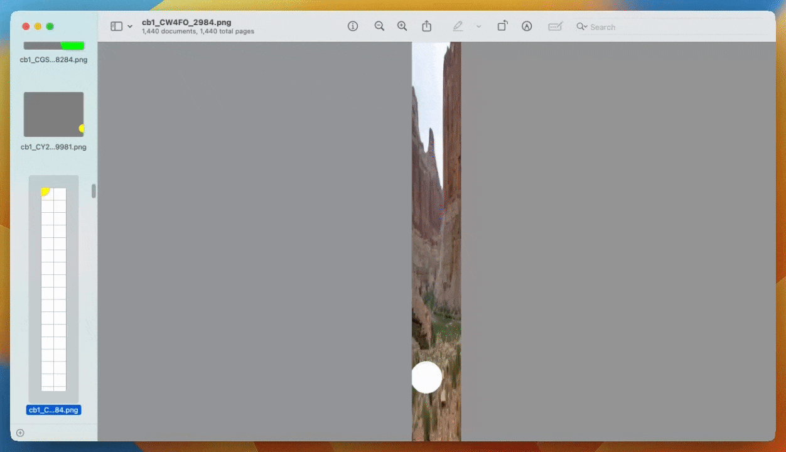

# LeftClickBench is a benchmark for clicking performance of AI models




LeftClickBench is a generated set of click targets on images of various sizes.

The tasks vary by:

- click target
  - position
  - shape (circles and rectangles)
  - color
  - size relative to the image
- image
  - size (standard desktop sizes + others)
  - background (fixed color, noisy images)

To pass each instance of a task, the model must output a message containing a single `click(x, y)` command.

Where models support tool use / function calling directly, we expose `click` as a tool.

If the x, y coordinates are within the click target, the task is successful.

## Task variation

We produce every combination of the following as a separate task, and then pick a random position within the image for the click target.

- shape: circle, rectangle
- color: red, blue, green, yellow, almost black, almost white
- size: 1%, 2%, 4%, 8%, 16%, 32% of image by area
- background: white, gray, black, one full color background image, one grid background image
- image size: 1024x768, 1280x1024, 1080x1920, 101x819

We represent each individual task instance (excluding the random click target position) as a 5-character alpha-numeric string using the following encoding:

**Format:** `cb1_ShapeColorSizeBackgroundImagesize_XxYy`

The full format includes positional information to ensure full reproducibility:

- **`ShapeColorSizeBackgroundImagesize`**: The 5 characters representing shape, color, size, background, and image size as defined below.
- **`_`**: Separator.
- **`Xx`**: Two digits (00-99) representing the reference X-coordinate as a percentage of the image width.
- **`Yy`**: Two digits (00-99) representing the reference Y-coordinate as a percentage of the image height.

**Parameter Encoding:**

1.  **Shape (1 char):**
    - `C`: circle
    - `R`: rectangle
2.  **Color (1 char):**
    - `R`: red
    - `B`: blue
    - `G`: green
    - `Y`: yellow
    - `K`: almost black
    - `W`: almost white
3.  **Size (1 char - Percentage of image area):**
    - `1`: 1%
    - `2`: 2%
    - `4`: 4%
    - `8`: 8%
    - `S`: 16%
    - `T`: 32%
4.  **Background (1 char):**
    - `W`: white
    - `G`: gray
    - `K`: black
    - `F`: full color background image
    - `B`: grid background image
5.  **Image Size (1 char):**
    - `S`: 1024x768 (Standard 4:3)
    - `M`: 1280x1024 (Medium 5:4)
    - `P`: 1080x1920 (Portrait 9:16)
    - `O`: 101x819 (Odd aspect ratio)

**Reference Point for Position:**

- For **Rectangles** (`R` shape): `XxYy` specifies the coordinates of the **top-left corner**.
- For **Circles** (`C` shape): `XxYy` specifies the coordinates of the **center**.

**Examples:**

- `cb1_CR1WS_2575`: Circle, Red, 1% size, White background, 1024x768 image. Center at X=25%, Y=75%.
- `cb1_RYSFM_1020`: Rectangle, Yellow, 16% size, Full color background, 1280x1024 image. Top-left corner at X=10%, Y=20%.
- `cb1_CG4KP_5050`: Circle, Green, 4% size, Black background, 1080x1920 image. Center at X=50%, Y=50%.

## Citation

If you use LeftClickBench in your research, please cite it as follows:

```bibtex
@misc{leftclickbench,
  author = {Thomas, George},
  title = {LeftClickBench: A Benchmark for Evaluating AI Model Clicking Performance},
  year = {2024},
  howpublished = {\url{https://github.com/geotho/leftclickbench}}
}
```
